# Diet Delight

## Description

Diet Delight is a modern web application designed to enhance the experience at Fit Life Gym by providing personalized meal plans and nutritional guidance to gym members. 

Diet Delight's primary contributors are John Fuentes, Hy Nguyen and Branden Chiem.

You can access the deployed App at https://diet-delight.netlfy.app/ 

## Github Repository

Frontend: https://github.com/jmcaluyafuentes/diet-delight-frontend  
Backend: https://github.com/jmcaluyafuentes/diet-delight-backend

## Functionality and Features

1. Search Recipes (MVP 1) - The app allows users to search for recipes by selecting dietary categories aligned with their fitness goals (e.g., high-protein for muscle gain, low-carb for weight loss).

2. Print Recipes (MVP 2) - Users can select and print recipes in PDF format, which provides a handy grocery list, or save the file for easy access.

3. Featured Recipes (MVP 3) - The app provides access to a curated list of recommended recipes that allows users to explore and choose appealing options.

4. User Management (Stretch 1) - Users can create their accounts. Registered users can log in, update their profiles and delete their accounts if needed.

5. Save Recipes (Stretch 2) - Registered users can save their favorite recipes for easy retrieval. They can also add or remove recipes from their saved list.

## Target Audience

- Fitness Enthusiasts - Individuals that seek diet plans that complement their workout routines.
- Gym Members - Fit Life Gym users who want to integrate healthy eating into their fitness regimen.
- Gym Instructors - Professionals who need a tool to recommend suitable recipes to clients.

## Tech Stack
<details>
 <summary>Frontend</summary>
### Frontend:
- HTML - The foundational markup language used to structure content on the web. HTML (HyperText Markup Language) defines elements such as headings, paragraphs, links, and other components that form the content of web pages.

- Vite - A modern build tool that offers a fast development server and optimized builds for production. Vite is designed to work seamlessly with JavaScript frameworks and libraries, such as React. It provides features like hot module replacement (HMR) and efficient bundling.

- @vitejs/plugin-react-swc - A Vite plugin that integrates the SWC compiler for React. It offers a faster alternative to Babel for transpiling React code, it improves build performance and reducing compile times.

- React.js - A popular JavaScript library developed by Facebook for building user interfaces. React allows developers to create reusable UI components and manage the state and lifecycle of these components efficiently. It uses a virtual DOM to optimize rendering and improve performance.

- React-DOM - A package that provides DOM-specific methods for React, allowing React to interact with the DOM. It works alongside React to render React components to the web page and manage updates.

- React-Router-Dom - A library for handling routing in React applications. It enables navigation between different views or pages in a single-page application (SPA) without reloading the entire page. It provides components like `<BrowserRouter>`, `<Route>`, and `<Link>` to manage routing and navigation.

- Bulma - A CSS framework based on Flexbox that helps in designing responsive and modern user interfaces. Bulma provides a set of ready-to-use CSS classes for layout, forms, buttons, and other UI components, making it easier to create aesthetically pleasing designs without writing extensive custom CSS.

- Netlify - A platform for deploying and hosting static sites and serverless functions. Netlify integrates with Git repositories to provide continuous deployment, automated builds, and easy management of frontend assets. It also offers features like form handling and serverless functions.
</details>
<details>
 <summary>Backend</summary>
### Backend:
- Node.js - A JavaScript runtime for server-side development that enables the use of JavaScript for backend applications with a non-blocking, event-driven architecture.

- Express.js - A lightweight web framework for Node.js that simplifies API and web application development with features like routing and middleware support.

- Mongoose - An ODM (Object Data Modeling) library for MongoDB that provides a schema-based solution for data modeling and management, simplifying database interactions.

- Render - A cloud platform for deploying and managing web applications, offering features like automatic deployments, scaling, and monitoring.

### Database:

- MongoDB Atlas - A cloud-based NoSQL database service for scalable and flexible data storage, used to manage recipe information.

### API Integration:

- Edamam API - An API service provider that offers extensive recipe and nutritional data, which enables integration of diverse recipe information into the application.
</details>
<details>
 <summary>Testing</summary>
### Testing:
### Frontend test libraries
 
- Vitest - A fast unit test framework designed to work with Vite. It provides a testing environment similar to Jest but optimized for Vite’s ecosystem.

- @testing-library/react - A testing library for React that encourages testing components in a way that simulates user interactions. It helps ensure that components work as expected from a user’s perspective.

- @testing-library/jest-dom - Provides custom matchers for Jest to test DOM nodes. It extends Jest’s default matchers with additional assertions for testing DOM elements, such as `toBeInTheDocument()`.

- @testing-library/user-event - A library for simulating user interactions in tests. It provides methods to simulate events like clicks, typing, and more, helping to test how components respond to user actions.

- @types/react-dom - TypeScript type definitions for React-DOM. It provides types for React-DOM methods and properties, improving type safety in React applications.

- jsdom - A JavaScript implementation of the DOM and HTML standards. It allows running tests that require a DOM environment, such as those using React, in a Node.js environment.

## Backend test libraries

- Jest - Provides a powerful and flexible framework for running tests and assertions in Node.js applications. It supports a wide range of testing scenarios and is highly configurable.

- Supertest - Used for testing HTTP endpoints, making it easier to verify that your backend API is functioning correctly and returning the expected results.

### Version Control and Collaboration:

- Git - A version control system that tracks code changes and manage project history.

- GitHub - A platform that host repositories, facilitates collaboration, and performs code reviews.

### Design and Project Management:

- Figma - A tool used to design user interfaces and creates interactive prototypes.

- Trello - A project management tool used to organize tasks, tracks progress, and collaborates with team members.
</details>
</details>  

## Dataflow Diagram
<details>
 <summary>Search and Print Recipes</summary>
### Search and Print Recipes (MVP 1 and 2)


### Featured Recipes (MVP 3)


## R3: Application Architecture Diagram


The frontend of the application renders the user interface and handles user interactions. Users can search for recipes, view detailed recipe information and select recipes to print. The frontend sends HTTP requests to the backend server to process user requests and retrieves the data.

The backend communicates with the Edamam API to fetch recipe data when users search for recipes. The API request includes parameters such as dietary categories and the response is processed by the backend before being sent to the front-end.

The backend temporarily saves recipe data retrieved from the third-party Edamam API in the database. This approach is useful to allow for quick access without repeatedly querying the external API. To comply with Edamam’s policy against permanent storage of recipe data, we use MongoDB’s Time-To-Live (TTL) feature to automatically delete the data after 10 minutes.

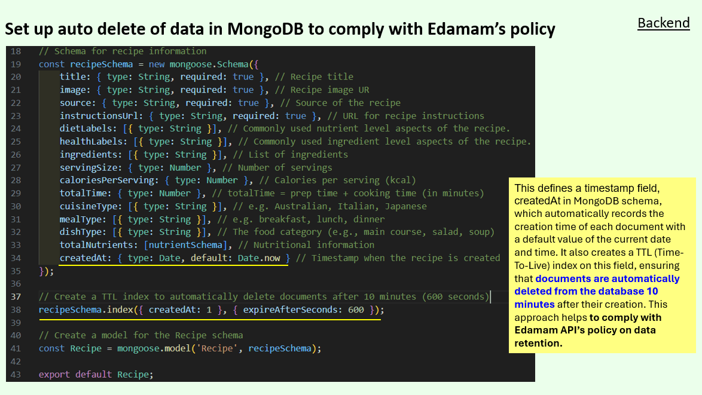
</details>
<summary>User Stories</summary>
<details>

### Dietary Category Search

* As a user, I want to be able to search for dietary categories (e.g., high-protein, low-carb) based on my fitness goals, so that I can find recipes and meal plans that align with my objectives.

* As a user, I want the search results to be personalized to my fitness goals and dietary preferences, so that I can easily find the most relevant information.

### Recipe Details

* As a user, I want to be able to view detailed information about each recipe, such as the nutrition information and recommended portion sizes, so that I can make informed decisions about my dietary choices.

* As a user, I want the recipe details to be presented in a clear and easy-to-understand format, so that I can quickly grasp the key information.

### Print to PDF

* As a user, I want to be able to select recipes and print them in PDF format, so that I can have a convenient, offline version for grocery shopping and meal preparation.

* As a user, I want the printed PDF to include a handy grocery list, so that I can easily shop for all the ingredients I need.

* As a user, I want the option to save the PDF file of recipes for easy access later, so that I can refer to it without needing an internet connection.

### Mobile Accessibility

* As a user, I want the application to be optimized for mobile devices, so that I can access the features and content on the go.

* As a user, I want the experience for mobile devices to be intuitive, so that I can easily navigate the application and find the information I need quickly.
</details>

## Wireframes
<details>
<summary>Wireframe Designs</summary>

### Homepage


### Dietary  Selection

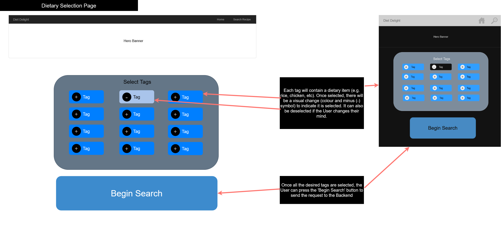

### Recipe Preview


### Recipe Details


### Recipes PDF Preview (Print Page)

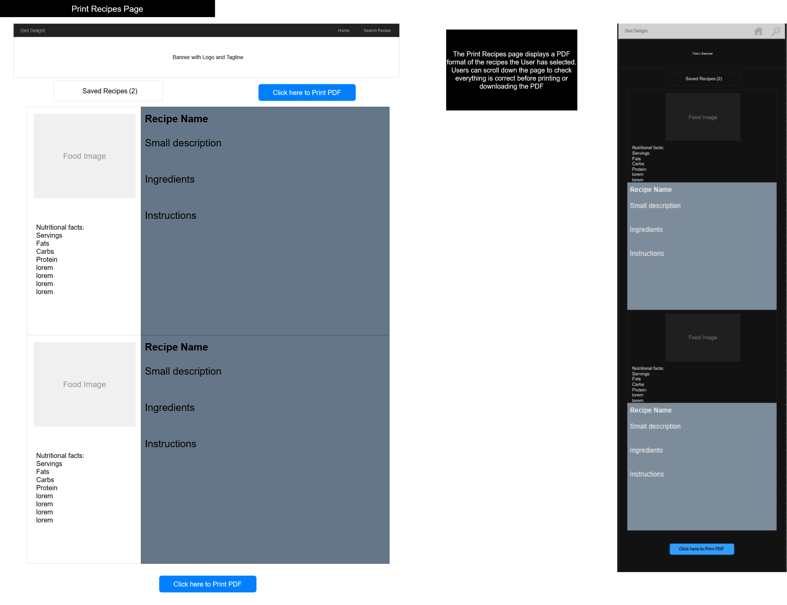
</details>

## R6: Trello Board Screenshots
<details>

Our team used Trello to manage our tasks due to its good visual, straightforward and user-friendly components.

Link to our Trello board --> https://trello.com/b/K1DuOj8t/diet-delight-web-app


### 14/08/2024 - Planning Stage Tasks

During the planning stage, we created a Trello board to organize and manage our tasks effectively. The board outlines the key tasks needed to develop the Diet Delight app, including feature development, bug fixing, and UI/UX improvements.


  

### Implementation Stage

During the implementation stage, our team focused on turning the initial plans into a functional application. We used Trello to track our progress, manage tasks, and adapt to any challenges that arose.

### 19/8/24


### 20/8/24
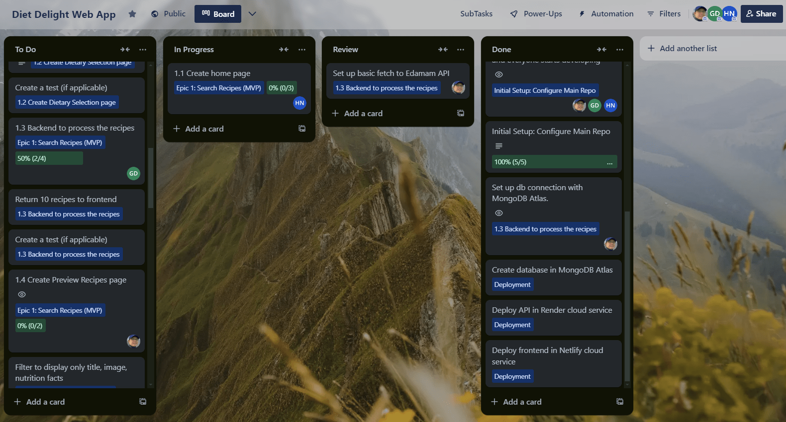

### 21/8/24


### 22/8/24


### 23/8/24
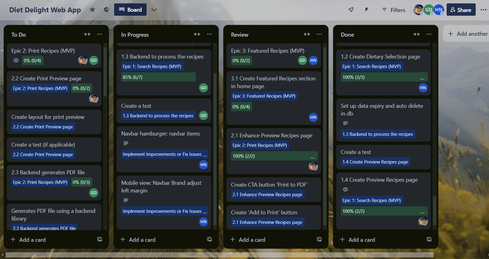

### 24/8/24


### 25/8/24
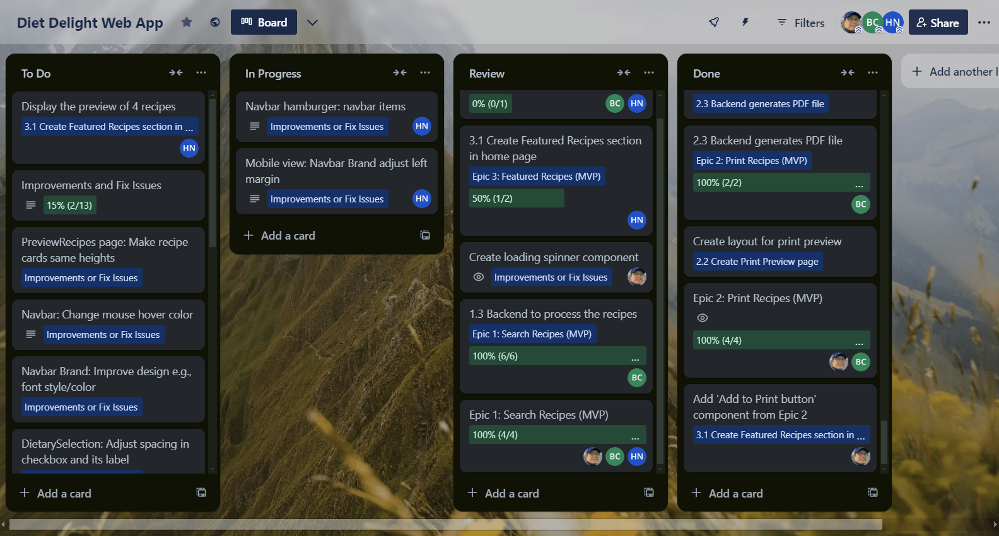

### 26/8/24
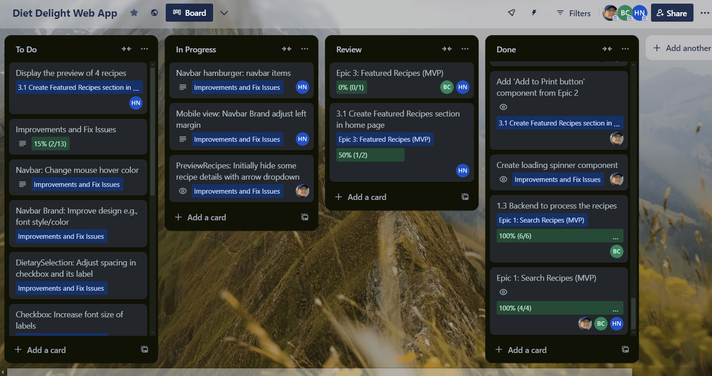

### 27/8/24
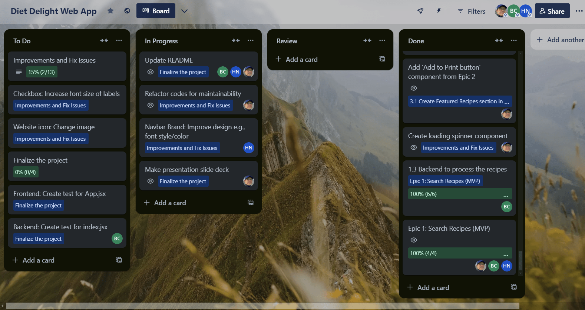

### 28/8/24


### 29/8/24
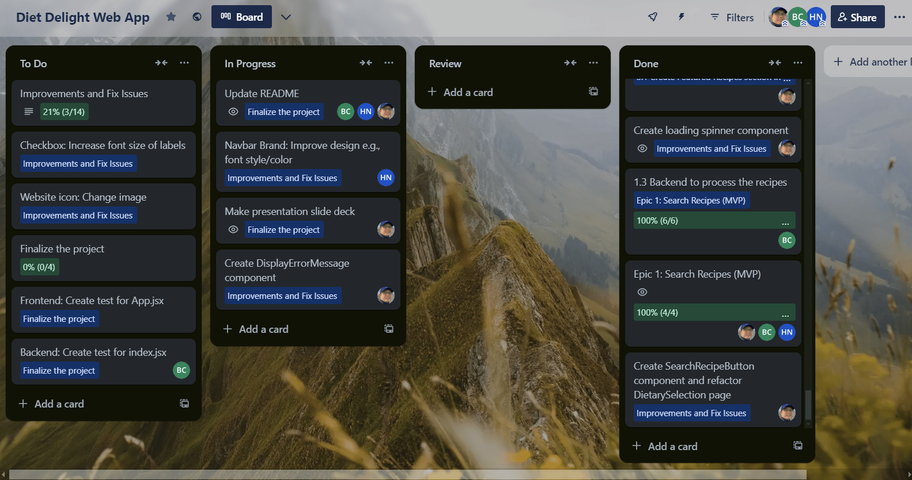

### 30/8/24
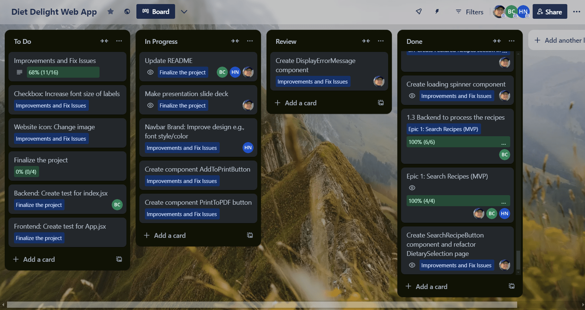

### 31/8/24
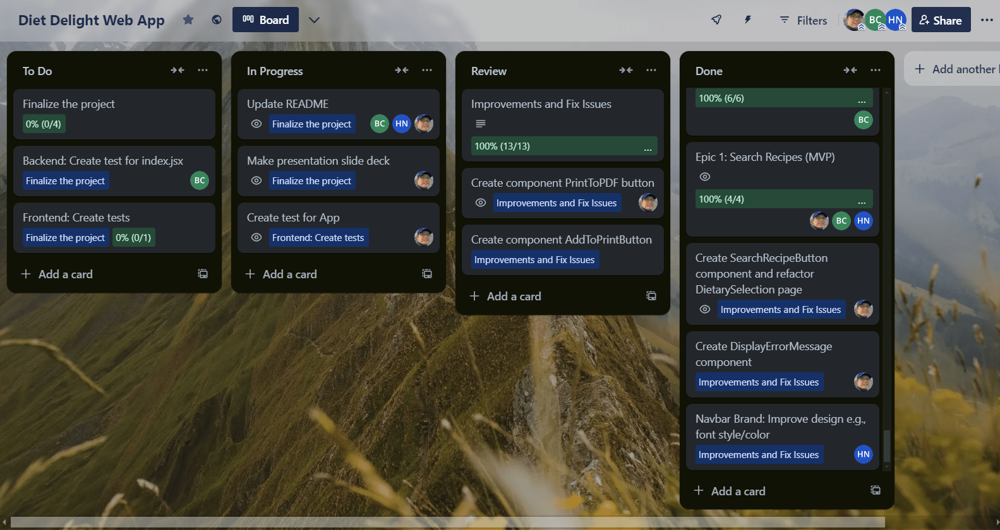

### 1/9/24
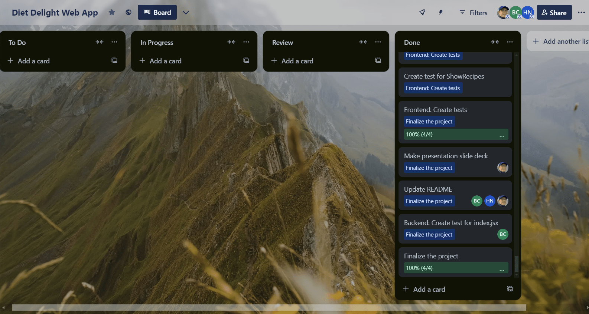
</details>

## Software Testing

### Introduction

This provides a summary of the production testing conducted for the Diet Delight App, aimed to evaluate usability, functionality, and performance to ensure the app meets user needs and Fit Life Gym's requirements.

<details>
 <summary>Testing Results</summary>

### Testing Results

### 1. Dietary Category Search

- Objective: Ensure users can search for recipes based on dietary categories.
- Result: Partially Passed
- Issues: The Render cloud server experienced a spin-down due to inactivity after a few minutes, causing delays in retrieving search results.
- Action: Manually access the Render cloud server shortly before testing sessions to ensure it is "spinned up" and ready to handle user requests.

### 2. Recipe Details View

- Objective: Verify clarity and comprehensiveness of recipe details.
- Result: Passed
- Issues: None
- Action: No action required
- Note: Cooking instructions are not provided directly by Edamam due to copyright restrictions. Instead, we include a link to the original recipe source where users can access the complete cooking instructions.

### 3. Recipe Printing in PDF Format

- Objective: Test PDF printing functionality.
- Result: Passed
- Issues: None
- Action: No action required
- Note: The PDF file was successfully generated and downloaded. The printed document includes the recipe details and a handy grocery list.

### 4. Featured Recipes

- Objective: Ensure users can access and view featured recipes.
- Result: Passed
- Issues: None
- Action: No action required
- Note: Featured recipes were displayed correctly, with links leading to full recipe details. The feature is functioning as intended, providing users with a curated list of recommended recipes. The recipes shuffle randomly at set time intervals, and the shuffling stops if the user adds a recipe to their print list.

### 5. Mobile Accessibility

- Objective: Ensure app usability on mobile devices.
- Result: Passed with Minor Issues
- Issues: Small touch targets leading to navigation difficulties.
- Action: Increase touch target size for improved usability.

## Client Feedback

- Positive feedback on app functionality and design.
- Suggestions for additional dietary categories and custom meal planning features.

## Summary of Findings

- Successes: Core features like recipe search and PDF printing performed well.
- Areas for Improvement: Performance optimization and mobile usability enhancements are needed.
- Next Steps: Implement performance improvements, refine the UI for mobile, and develop the strech features for user and recipe management.

## Conclusion

The Diet Delight App meets core objectives but requires optimization for enhanced user experience, especially on mobile devices. The development team will focus on performance improvements and expanding the app’s features in future updates.
</details>
<details>
 <summary>Screenshots from Production Testings</summary>
## Screenshots from Production Testing
### Landing page (Home)

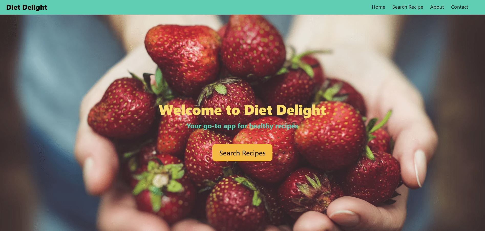

The main landing page of the Diet Delight app, showcasing the initial user interface and navigation options.

### Dietary Selection page

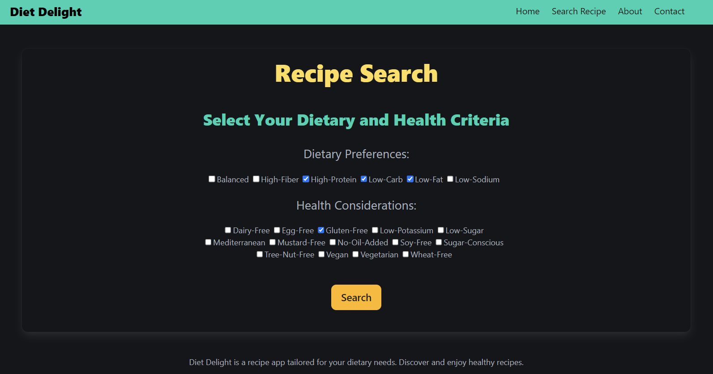

The page where users select their dietary preferences to customize their recipe search.

### Show Recipes page

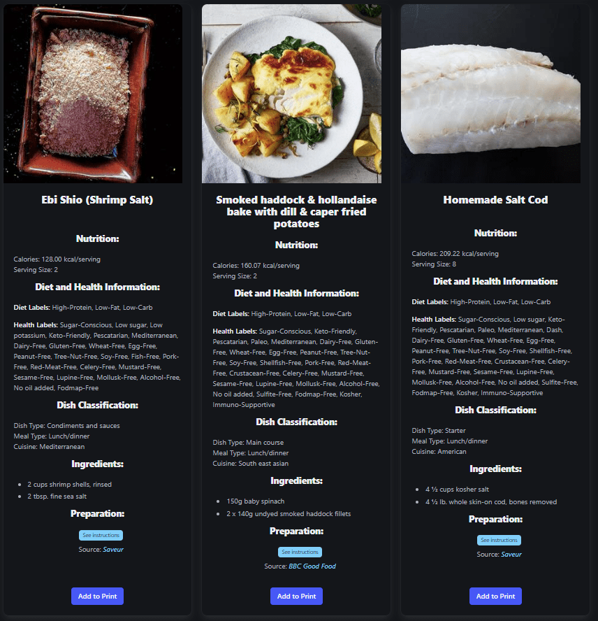

Displays the list of recipes based on user-selected dietary categories, including options to view details and add recipes to print.

### Print Preview page

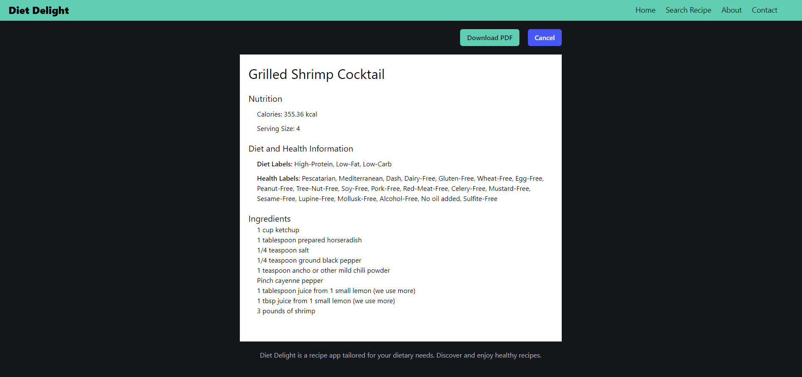

The preview page for recipes selected for printing, allowing users to review content before generating the PDF.

### Downloaded PDF File


The PDF file generated and downloaded from the app.

### Featured Recipes section in Home page

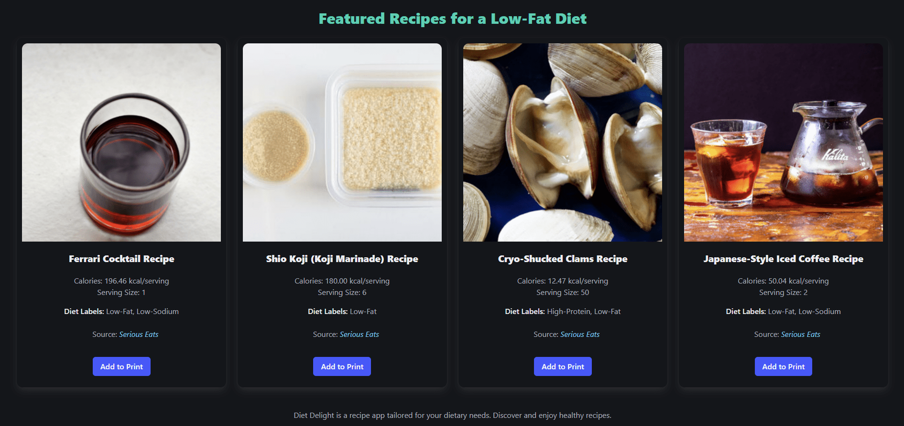

The section on the home page highlighting featured recipes, with dynamic shuffling and options to view recipe details.

## Error Handling in the App

### Error Message: No Criteria Selected

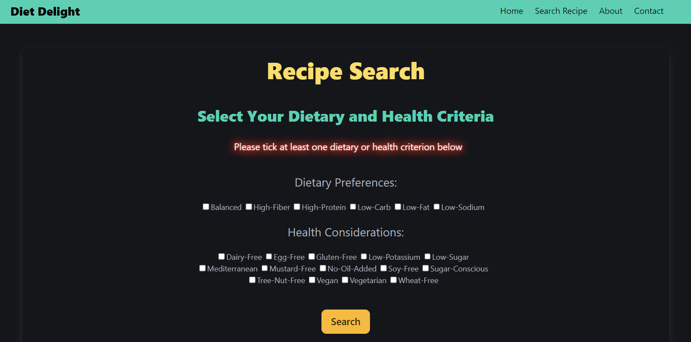

Displayed when the user clicks the search button without selecting any dietary criteria. This error prompts the user to specify their dietary preferences before proceeding.

### Error Message: No Recipes Found

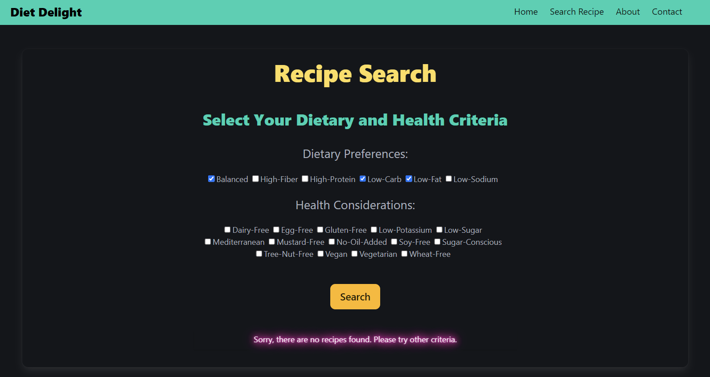

Displayed when the app cannot find any recipes matching the selected criteria. This error encourages the user to modify their search criteria for better results. 
</details>

## Installation Guide

Follow these steps to get the project up and running on your local machine.

### 1. Prerequisites

Make sure you have the following installed:

- Node.js  
- npm (Node Package Manager)

### 2. Clone the Repository

First, clone the repository to your local machine:

```
git clone https://github.com/jmcaluyafuentes/diet-delight-frontend.git
```

Navigate to the project directory:

```
cd diet-delight-frontend
```

### 3. Install Dependencies

```
npm install
```

### 4. Running the Application

To start the development server, run:

```
npm run dev
```

This will start the application on http://localhost:5173/ by default.

### 5. Running Tests

```
npm test
```
